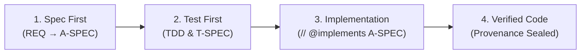

# 🔍 Holmes-Kit

[](https://www.npmjs.com/package/@holmes-lab/holmes-kit)
[](https://nodejs.org)
[](https://github.com/holmes-kit/holmes-kit/blob/main/LICENSE)

> **"No Spec, No Code"** — Deterministic Agentic Software Engineering (ASE) harness with causal traceability.

---

## 🕵️ Philosophy & Vision: Beyond Code Generation

**Holmes-Kit** is not merely an AI code generator. Inspired by **Sherlock Holmes**, Holmes-Kit is built to **deduce, track down, and analyze code defects, structural drift, and security vulnerabilities** across the full Software Development Life Cycle (**SDLC**).

---

### 🛡️ Currently Supported Features (v0.1.x Production Features)

- 📋 **Requirements & Specification Governance**: Strict **"No Spec, No Code"** enforcement with 4-tier spec chain traceability (`REQ ➔ H-SPEC ➔ A-SPEC ➔ T-SPEC`) and `// @implements A-SPEC-XXX` line 1 code anchors.
- 🐞 **Causal Defect Localization & CPG**: AST Code Property Graph (CPG) & Dataflow Taint reachability analysis across 7 languages (TS/JS, Python, Go, Rust, Java, C/C++, C#).
- 🧪 **Self-Healing & Diagnostic Doctor**: Automated integrity checks and self-healing auto-fix remediation (`holmes-kit doctor --fix` & `spec_remediate`).
- 🚦 **CI/CD Governance Gate Runner**: Non-interactive headless CI/CD build gate (`holmes-kit ci`) for GitHub Actions and GitLab CI pipelines.
- 📊 **Automated RTM & Taint Heatmap**: Interactive standalone HTML/SVG report generation (`generateRtmHeatmap`) for spec coverage and security dataflow reachability.
- 🤖 **CLI-First AI Harness Matrix**: Native process hook gating for Claude Code, Antigravity CLI (AGY), Codex CLI, and Google Antigravity SDK.

---

### 🚀 Full SDLC Vision & Roadmap (Future Goals)

Holmes-Kit strives to expand into a unified enterprise SDLC harness bridging external development tools:
- 🔌 **Enterprise Issue Tracker Connectors**: Flexible synchronization with Jira, GitHub Issues, Linear, and Notion.
- 🌐 **Multi-Repository Polyrepo Governance**: Multi-repo spec chain synchronization and cross-repository dependency impact analysis (`REQ-211`).
- 🛡️ **External SAST & Linter Bridge**: Deep integration with SonarQube, Semgrep, and ESLint findings.

---

## 🤖 Supported AI Coding Tools & Environments (CLI-First Focus)

Holmes-Kit prioritizes **CLI-based AI Coding Agents** where OS-level process hooks, subshell isolation, and deterministic control plane enforcement are natively guaranteed:

| AI Coding Agent / Framework | Harness Tier | Integration & Enforcement Mechanisms |
| :--- | :--- | :--- |
| 🤖 **Claude Code CLI** | 🥇 Tier 1 (Native) | OS PreToolUse & Stop hooks (`.claude/settings.local.json`), MCP server (`.mcp.json`) |
| 🚀 **Antigravity CLI (AGY)** | 🥇 Tier 1 (Native) | AGY Hooks (`hooks.json`), MCP config (`.agents/mcp_config.json`), Governance Skills |
| 💻 **Codex CLI / Agentic Shell** | 🥇 Tier 1 (Native) | Codex MCP integration (`.codex/mcp_config.json`), Subshell Isolation Gates |
| 🧩 **Google Antigravity SDK** | 🥇 Tier 1 (Native) | Autonomous Agent SDK bindings and cryptographic provenance verification |

> **Note**: Holmes-Kit focuses strictly on CLI-based autonomous agents to guarantee 100% deterministic OS hook gating (`deny` enforcement) before file modifications occur.

---

## ⚡ Quickstart (3-Minute Setup)

### 1. Install CLI
```bash
npm install -g @holmes-lab/holmes-kit
```
*(Requires Node.js `>= 20.0.0` and C++ build tools for native SQLite/tree-sitter)*

### 2. Initialize in Your Project
```bash
cd /path/to/your/project
holmes-kit init
```
*An interactive prompt will ask which AI agent harnesses to wire into your project:*
```text
? Select the AI Agent harnesses to wire into this project:
  [X] 🤖 Claude Code          (.claude/settings.local.json, .mcp.json)
  [X] 🚀 Antigravity CLI (AGY) (.agents/mcp_config.json, hooks.json, skills)
  [ ] 💻 Codex CLI            (.codex/mcp_config.json)
```

### 3. Verify Health
```bash
holmes-kit doctor
```
*If everything is green, your project is governed and ready for AI pair-programming!*

---

## 🔄 Daily Workflow (How It Works)

Once initialized, your AI agent automatically follows the **No Spec, No Code** lifecycle:



1. **Spec First**: The agent authors requirements and architecture specs via `spec_create`.
2. **Test First**: The agent writes tests and approves `T-SPEC` before writing implementation code.
3. **Implement**: Code files anchor to their architecture spec with `// @implements A-SPEC-NNN`.
4. **Deterministic Guard**: If the agent attempts to write code without approved specs, **Holmes-Kit hooks block the action and provide exact next steps**.

---

## 🧰 Essential CLI Cheatsheet

| Command | Purpose |
| :--- | :--- |
| `holmes-kit init` | Interactive agent harness setup (Claude, Antigravity, Codex) |
| `holmes-kit init --agent all` | Non-interactive instant setup for all supported agents |
| `holmes-kit init --dry-run` | Preview files and configuration changes without writing |
| `holmes-kit doctor` | Comprehensive health check of specs, hooks, MCP, and anchors |
| `holmes-kit doctor --fix` | Automatically self-heal and repair broken hooks or missing skills |
| `holmes-kit ci` | Run non-interactive headless governance gate for GitHub Actions / GitLab CI |
| `holmes-kit ci --json` | Run CI gate and emit machine-readable JSON results |

---

## 🧩 Optional: Manual MCP Integration (Cursor, Windsurf, Claude Desktop)

> **Note**: If you ran `holmes-kit init`, this configuration is **100% automated for you**.  
> Use the manual configuration below only if you wish to integrate Holmes-Kit into standalone third-party MCP clients like Cursor, Windsurf, Claude Desktop, or VS Code:

```json
{
  "mcpServers": {
    "holmes-kit": {
      "command": "npx",
      "args": ["-y", "--package=@holmes-lab/holmes-kit", "holmes-mcp"],
      "env": {
        "HOLMES_SPECS": ".ax/specs"
      }
    }
  }
}
```

---

## 🌐 Supported Languages & Environments

Holmes-Kit embeds native AST & Code Property Graph (D-CPG) analyzers to track causal relationships and anchor implementations across diverse technology stacks.

### 💻 Supported Programming Languages
| Language | CPG Parser | Anchor Syntax | Dataflow Taint & RTM |
| :--- | :--- | :--- | :---: |
| **TypeScript / JavaScript** | Tree-sitter TypeScript/JS | `// @implements A-SPEC-XXX` | ✅ Full Support |
| **Python** | Tree-sitter Python | `# @implements A-SPEC-XXX` | ✅ Full Support |
| **Go** | Tree-sitter Go | `// @implements A-SPEC-XXX` | ✅ Full Support |
| **Rust** | Tree-sitter Rust | `// @implements A-SPEC-XXX` | ✅ Full Support |
| **Java** | Tree-sitter Java | `// @implements A-SPEC-XXX` | ✅ Full Support |
| **C / C++** | Tree-sitter C/C++ | `// @implements A-SPEC-XXX` | ✅ Full Support |
| **C# (.NET)** | Tree-sitter C# | `// @implements A-SPEC-XXX` | ✅ Full Support |

### 🖥️ Supported Operating Systems & Runtimes
| OS / Platform | Architecture | Status | Notes |
| :--- | :--- | :---: | :--- |
| **macOS** | Apple Silicon (arm64) / Intel (x64) | ✅ Tier 1 | macOS 12+ (Full hook enforcement) |
| **Linux** | x86_64 / arm64 | ✅ Tier 1 | Ubuntu, Debian, Fedora, Arch, RHEL |
| **Windows (WSL2)** | x86_64 | ✅ Tier 1 | WSL2 Ubuntu/Debian recommended |
| **Windows Native** | x86_64 | ✅ Tier 2 | Windows 10/11 (Node.js 20+ with C++ build tools) |

> **Runtime Requirement**: Node.js `>= 20.0.0` (LTS recommended)

---

## 🔒 Source Code Availability & Distribution Policy

- **Distribution Mode**: Holmes-Kit is currently distributed and executable as an official public npm package ([`@holmes-lab/holmes-kit`](https://www.npmjs.com/package/@holmes-lab/holmes-kit)).
- **Source Code Status**: The underlying source code repository is currently **private / closed-source**.
- **Open Source Consideration**: Decisions regarding whether, when, and how to transition to a full open-source codebase will be reviewed and determined in future milestones based on enterprise feedback, security audits, and community governance requirements.

---

## 📜 License

Distributed under the [MIT License](https://github.com/holmes-kit/holmes-kit/blob/main/LICENSE).
