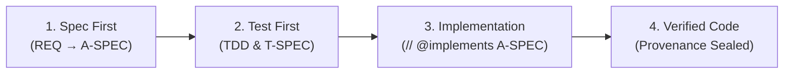

# 🔍 Holmes-Kit

[](https://www.npmjs.com/package/@holmes-lab/holmes-kit)
[](https://nodejs.org)
[](https://github.com/holmes-kit/holmes-kit/blob/main/LICENSE)

> **"No Spec, No Code"** — Deterministic Agentic Software Engineering (ASE) harness with causal traceability.

---

## 🕵️ Philosophy & Vision: Beyond Code Generation

**Holmes-Kit** is not merely an AI code generator. Inspired by **Sherlock Holmes**, Holmes-Kit is built to **deduce, track down, and analyze code defects, structural drift, and security vulnerabilities** across the full Software Development Life Cycle (**SDLC**).

---

### 🛡️ Currently Supported Features (Production Features)

- 🔢 **A spec number another machine took is seen before the merge** *(new in 0.26.1)*: two checkouts allocated `REQ-694` thirteen minutes apart, neither could see the other, and it surfaced only as an add/add conflict after the push was refused — a rebuilt slice and five out-of-band approvals. `doctor --target` now reads each remote-tracking ref **as last fetched** (no network) and judges only the documents each side *added* since they parted, so a spec one side merely edited is divergence, not an alarm. On a collision the advice is the plan: `Before merging — move 901 → 903: spec_renumber(oldBase=901, newBase=903); then re-seal`. The side that moves is the one not published yet, the destination is free on both sides, and "published" means equal content — never path, because a spec's path is its number.
- 🔁 **The cycle ratchet finally speaks — and takes a named exception** *(new in 0.26.1)*: since the commit that introduced it, the Stop hook computed the code cycles and called the verdict without them, so the `ART-2` line had never been printed; every unit test passed because each handed the evidence in directly. It is emitted now, bounded (five cycles, five members each, the rest counted — one vendored cycle here has 46 members), and `ax.config.json` gains `architecture.cycleIgnore`: prefixes for trees that are not yours to fix. A cycle is excepted only when every member lies under one, `reference` does not pardon `reference-impl/`, a broken config excepts nothing, and excepted cycles stay counted in the ledger.
- 🧬 **Declare your architecture, in every language the graph can follow** *(new in 0.26.0)*: a C-SPEC's `## Forbidden Edges` takes a third rule kind beside `import` and `call` — `- inherits src/app -x-> ConcreteBase`, an exact match enforced at the pre-edit gate. Nothing is inferred: the rule reads the graph's `inherits` edges and never asks which class is "abstract", which is what makes it hold in Go, where interface satisfaction cannot be inferred at all. A project that already breaks the rule it wants adopts it with a **baseline that expires** — `- allow until 2026-09-27 : inherits src/legacy/a.ts -> LegacyBase`, exact on kind, file and target, never a prefix. Past its date the allowance still holds, because an expiry that blocked would turn the rule into a barrier to adoption; it is **reported** instead, carrying `(reconfirmed n since <date>)` so a twelfth renewal cannot hide.
- 🏛️ **The architecture verdict reaches the person closing the turn** *(new in 0.26.0)*: the scan-wide judgement existed and nothing in the product called it — measured, zero consumers outside the tests — so an expired baseline was neither blocked nor seen, and a time-boxed allowance could not be told from a permanent pardon. The Stop hook now prints `ARCH` lines on the non-blocking `tracked` channel: violations no baseline covers, expired baselines with their renewal count, and **which rule kind could not be judged in which extension** (`inherits rules NOT judged in: .js, .py, .tsx`) — asked per kind, over the files a rule of that kind actually judges, because a pooled answer called a language *judged* for a rule it could not see. No rule declared, nothing said and nothing paid: the judgement shares the one scan the cycle ratchet already makes (measured here: scan 6.6 s, judgement 0.14 s).
- ♻️ **The cycle ratchet judges every language it can resolve** *(new in 0.26.0)*: the Stop hook had re-implemented import resolution beside the graph builder's — relative specifiers only, four extensions. Measured on fixtures shaped the way each language requires: 16 import edges, 2 survived; 9 planted cycles, 1 found. It cost nothing in an all-TypeScript tree (919 edges either way), which is how it survived to 0.25, and everything in a Java, Go, Python or Rust consumer. There is now **one** resolver, consumed by both; a language whose specifiers do not resolve stays `unavailable` rather than reading as clean, and a wide Go package cycle is capped per cycle with the dropped members counted.
- 🔑 **The id a refusal prints can be granted** *(new in 0.26.0)*: `approve --grant <id>` resolved references against the decision inbox alone, and a shell hard-HITL refusal lives in the per-machine refusal log — so the very id the refusal printed failed before the fallback that handles it could run, and the owner had nothing to approve. Id and prefix references now resolve across both stores. A **number** still means only the row you were shown, a prefix that collides across the stores is refused by name, an unreadable log removes candidates rather than granting, and the inbox list is unchanged.
- 📬 **A reporter hears that their defect was fixed** *(new in 0.26.0)*: a defect filed through `holmes-kit report` is matched — locally, once — against the list of resolved reports that ships in the package, and the session start says so. Nothing is sent anywhere.
- 🔦 **A semantic layer that is inert says so** *(new in 0.25.0)*: the tier line said what was CONFIGURED, never whether one lookup would succeed. Measured on this repository: the resolved tier was `cloud` and **0 of 602 scanned files** had a cached document vector under it, so every lookup returned nothing — reranking reordered nothing, alternates emitted nothing, and the output was byte-identical to a layer that examined everything and agreed. A naive check would have counted the 532 vectors sitting in the cache and called it healthy; they keyed on symbol lists that no longer existed. `doctor` now reports coverage against the files scanned NOW, through the runtime's own accessor, in four states — the two that cannot be judged say so rather than passing quietly.
- 🔁 **Vectors refresh on the channel that keeps the graph fresh** *(new in 0.25.0)*: the graph self-heals through the Stop hook's detached child; the vectors did not, because warming was reachable only from an explicit `rtm_reindex`. The cache key hashes the file's path plus its symbol names, so every edit that renames a symbol invalidates that file's vector — twelve days of work had taken coverage to zero. The refresh now warms too, and the Stop hook reports the verdict the child recorded rather than scanning (tree-sitter wasm must not ride into a gate process); **a missing verdict reads as "not run", never as a pass**. Warming under the cloud tier is egress, so it is automatic AND observed, with `HOLMES_NO_SEMANTIC_WARM` to switch the transfer off — an owner who switches it off is shown a switch, not a fault. The verdict records the commit it was taken at, so work merged from another machine reports **needs re-measuring** instead of yesterday's numbers as today's truth.
- 🎣 **The graph can introduce a candidate your words never named** *(new in 0.25.0)*: `issue_localize`'s semantic rerank could only reorder what lexical matching already found, so a question phrased in intent vocabulary never reached the file that answers it. Measured with the tier live and the vectors warm: asking *who opens a URL in the user's browser* ranked an unrelated file first on the shared prose word "repository", at 3.3× the second score, and never returned `open-url.ts` — which the graph held the whole time. The same need in mechanism vocabulary found its answer at rank 4. `semanticAlternates` now carries the top cached-vector matches among files the emission missed, and that file comes back at cosine 0.754. **Pure addition on its own field**: the ranked hits are untouched in set, order and score, because admitting candidates INTO a ranked set is where this project measured precision being lost.
- 🪧 **The semantic ladder reaches you without running `doctor`** *(new in 0.25.0)*: measured here on 305 traceability cases, recall goes 0.486 lexical → 0.667 local → **0.887 cloud**, and on requests lexical search misses entirely, recovery goes 0% → 52% → **92%** — and a consumer never learned any of it, because only `doctor` said so. `init` now names the ladder with those numbers and the command for each, and the session banner says it **once** per workspace on a machine and then never again. `local` is named before `cloud` on purpose: `none` is the default because egress needs consent, not because nobody got to it, and the cloud line states what leaves the machine. A consumer who has already chosen hears nothing.
- 📮 **`holmes-kit report` — a defect can reach the maintainers** *(new in 0.24.0)*: until now a consumer's holmes-kit defect had no way back to us; the one we learned about arrived because someone pasted a transcript, and it had been reproducing for every consumer on every slice. The command writes a **redacted** report to `.ax/reports/<fingerprint>.md` and prints a prefilled GitHub issue link — title, assignee, body — plus a search link for the same fingerprint so you can see whether it is already known. `--open` opens it; on a headless box or over SSH the printed link is the whole of it. **No token, no API, nothing sent automatically**: you press Submit on GitHub's own page with the body in front of you and editable. Redaction is an allowlist rather than a scrubber — this project's own remote carries a token before the `@`, its replica ids carry a person's name, and its spec titles are unreleased product intent, so a path, a credential or a machine identifier withholds the field and the report says which. A spec id passes by shape; a spec title does not. And what holmes-kit cannot know, it says: no ledger keeps its own refusal text, so a report with no description states that rather than pretending.
- 🧭 **A skipped graph analysis is visible** *(new in 0.24.0)*: `AGENTS.md` asks for `maintenance_analyze` before editing source, and nothing checked. Measured on this repository, the step had been skipped for seventeen consecutive commits — and the run that followed named child-process precedents a name search had missed completely, because the question was "who opens a browser" while the answer lived under "who spawns a child". The Stop hook now reports source changed with no analysis standing open: non-blocking, judged by commit rather than by clock, and silent in a workspace that never adopted the habit.

**Earlier releases** — condensed to one line each; every release's full account lives in [CHANGELOG.md](CHANGELOG.md).

- 🧱 **A stale build is told, not discovered** *(0.23.3)*: the Stop hook reports a `dist/` that no longer represents the source, judged by the **build id and never by mtime** — a stale build does not go red, it verifies old code and returns green; the two states that cannot be judged say that rather than passing quietly.
- 📐 **Declarations are read as written** *(0.23.2)*: `Files to Touch` is read wherever a path sits — several on one line, an indented continuation, a Korean first word — after 88 specs and 172 declared paths were measured as never read; an unambiguous abbreviation is reported as one, and nothing is guessed.
- 📄 **The publish gate reads the docs** *(0.23.2)*: the release gate refuses a missing CHANGELOG entry for the version being published, and an `### Added` entry while `README.md` has not changed since the previous release; what needs judgement stays with the person and is reported, never faked.
- 🧩 **Your config files survive a re-wire** *(0.23.0)*: `init --agent antigravity|codex` refreshes only the holmes-kit entry instead of replacing `.agents/mcp_config.json`, `hooks.json` and `marketplace.json` whole — a neighbour server, hook, plugin and your own `disabled` flag all survive, and an unreadable JSON file is refused with a reason rather than overwritten.
- 🫀 **The MCP supervisor notices a child that died** *(0.23.0)*: a crashed child used to leave the server **permanently deaf**; outstanding requests now get a JSON-RPC error first, then the supervisor resets, respawns and replays the opening exchange — with a restart budget spent only by a child that never answered.
- 🧮 **Coverage you can explain** *(0.23.0, corrected in 0.23.2)*: the RTM census says *what each unlinked spec declared* (`scanned-source`, `file-anchor-target`, `test-target`, `unreachable-target`, `no-declaration`). The "zero" 0.23.0 published here was the Files-to-Touch parser's, not the corpus's — the corrected census reads three, with five real trace gaps behind it.
- 🤖 **A CI matrix that judges every commit** *(0.22.0)*: a maintainer-side Linux runner appends exactly one `ci-runs` row per commit for **every** outcome, including the ones it could not judge; a missing row reads as "not run", never as a pass. Workspaces that never adopted it hear nothing about it.
- 🔁 **Advisories learn what happened next** *(0.22.0)*: every finding carries a deterministic id, and the next `approval_status` re-runs the same functions to record `resolved` or `persisted` — the numerator every "promote to a hard gate once we know the false-positive rate" sentence was missing. `dismiss: [id]` retires one an author judges unhelpful.
- 🧪 **`kills` that cannot apply say so** *(0.22.0)*: `test_run --mutate` reports `unapplied` separately from `survivors` — measured here, all 22 `kills` entries in this repository applied **none** while the response still read `survivors: []`, the shape of a clean run.
- 🔎 **The RTM stops claiming coverage it cannot see** *(0.21.0)*: `codeLinkedPct`, `unlinkedCount` and `unlinkedByReason` join the old `coveragePct`, which read 100 while 11.4% of approved specs carried no `implements` edge — plus a Files-to-Touch fulfilment advisory and `rtm_impact` **trace gaps** (a spec that declares a changed production file yet anchors only tests).
- 🩹 **`@known-defect(reason, expires=YYYY-MM-DD)` and article ART-9** *(0.21.0)*: a test that pins a known defect as its expected value carries a machine-readable marker — listed as debt while live, blocking only once it has **expired** or cannot be read. A bypass is sometimes right; the marker is there so the next person can see it.
- 🧑‍🤝‍🧑 **Concurrent multi-agent workspace** *(0.20.0)*: several agents, machines and clones converge on one spec store through Git — replica-stamped provenance, UUID-keyed entities that renumber without losing identity or approval closure, `entity_integrate` with per-side conflict evidence, and single-use approvals whose double-spend freezes every authority-spending act until `ledger_reconcile`. Reproduced end to end outside this repository on macOS and Linux.
- 🗂️ **Approval decisions you can actually see** *(0.20.0)*: `approve --status` shows who asked (run · replica · workspace), the risk grade, the subject digest and exactly what a grant would open. A grant is bound to the workspace it was minted in and to the content the human read — a copied one is `foreign-workspace`, changed content is `stale-subject` — and `--revoke` withdraws it.
- 🔁 **Import cycles are governed** *(0.19.0)*: guidance reaches the agent before it designs, a `graphPreview.cycles` advisory names the cycles your declared files are already in (each edge classified `type-erasable` / `lazy-require` / `eager-value`), and a Stop-hook ratchet in `track` catches new ones — the escape is a **named exception**, never a threshold, so a project carrying legacy cycles can still adopt the harness. This repository went three cycles → zero.
- 📐 **Size and fan-in, shown but never judged** *(0.19.0)*: lines, symbols, longest function, fan-in and fan-out per declared file. Numbers only — a test pins the **absence** of a severity field, because one would grow into the gate the evidence does not support.
- 🎯 **Candidates you could actually act on** *(0.19.0)*: history-derived candidates must be able to be source (**63.3%** of emission slots were going to files that cannot be the answer), vendored trees are demoted, and def-use ranking orders symbols inside a file the search already found.
- 🧭 **The graph speaks BEFORE you commit to a scope** *(0.18.0)*: `approval_status` answers `graphPreview` — `impact` (what calls into your declared scope from outside it) and `density` — computed by the **same functions the sealing advisory uses**, so the preview can never disagree with the seal. `maintenance_analyze` candidates ride with the ADRs constraining each file. Information only: tests pin that no ranking or gate reads them.
- 📜 **ADR as a first-class governed document** *(0.18.0)*: `spec_create(type: "ADR")` scaffolds a decision document under full authoring governance, with its **own number space** and a **hitl-only seal** (autonomy never self-approves a decision). `ADR-XXXX` citations become `constrained_by` edges; legacy `.ax/decisions/` entries coexist. Migration guide at `docs/adr-migration.md`.
- 📣 **Impact advisory at sealing time** *(0.16.0, hardened in 0.17.0)*: approving an A-SPEC returns what your Files-to-Touch declaration **missed** — files whose symbols call into the declared scope from outside it. Advisory, never verdict: it rides the response after the seal commits, degrades to absence on failure, and every emission is ledgered so its false-positive rate is **measured before** anyone proposes a hard gate. Approved-only, capped (a hub-grade response shrank −82%), with an anchor-density advisory alongside.
- 🗣️ **The graph speaks intent** *(0.16.0)*: every SPEC node stores a one-sentence intent summary, extracted deterministically and **never generated**, so an advisory shows *which intent* is at risk without a spec-store round trip. Information only.
- 📇 **Session-context observability** *(0.16.0)*: the ledger records which agent/model drove a session and what the governance overhead cost, per replica — field reports grounded in machine attribution instead of guesswork.

**Foundations** — in place since the early releases, still load-bearing.

- 📋 **Requirements & specification governance**: strict **"No Spec, No Code"** across a 4-tier chain (`REQ ➔ H-SPEC ➔ A-SPEC ➔ T-SPEC`) with `// @implements A-SPEC-XXX` code anchors — comma-lists and every anchor in a file participate in the gate.
- 🔴 **Inbuilt TDD — RED-first, enforced not asked** *(0.9.0)*: constitution article **ART-8** requires a recorded `red-assertion → green` sequence in the ledger, and a `red-error` (a test that could not run) is not a valid RED — so "the covering test failed *correctly*" is judged mechanically, not on trust. Ships observe-first (`redFirstEvidence: track`). Where superpowers *asks* for RED-first, holmes-kit *proves* it.
- 🧱 **Deterministic gate, hardened** *(0.8.0, 0.13.0)*: shell writes are judged at the segment's **effective working directory**, the governing anchor is the whole set rather than the first match, a project is governed when **any** spec exists, and `cp`/`mv` are classified by **destination**. Every gate change ships with two consecutive clean adversarial rounds.
- 🤖 **Autonomous approval — three layers, always bounded** *(0.8.0, reworked 0.13.0)*: a project default (`init --autonomy`) and an expiring per-session envelope let the agent seal **low-risk** specs itself under an `autonomous:<client>` actor; every governance-critical, high-risk or irreversible decision is refused and routed to the out-of-band `holmes-kit approve` queue. The agent can never grant it to itself, the posture is surfaced at every session start, and off is byte-identical to a fully human-gated project.
- 🧭 **Compatibility and evolution gates** *(0.14.0, 0.15.0)*: a new A-SPEC seals only with `harness_impact:` and `os_impact:` declared and machine-cross-checked against Files-to-Touch; separately, a changed in-scope source that **newly introduces an external dependency** raises a spec-reappraisal — a warning when manual, a queued item under autonomy, never a blocked turn.
- 🚢 **Release autonomy + docs-currency gate** *(0.13.0, machine-checked in 0.23.2)*: `npm publish` stays **human-approved by default** while a deterministic classifier lets a low-risk release self-publish under the ledger; a major bump or any gate-behavior/security/architecture spec forces HITL. The publish gate refuses a release whose docs never caught up — a stale doc is a false claim.
- 🧠 **3-tier semantic layer** *(0.3.0)*: an explicit consent ladder — `none` (default, **zero egress**), `local` (bge-m3, no egress), `cloud` (gemini-embedding-001, opt-in). Measured on 305 traceability cases: recall 0.486 → 0.667 → **0.887**; on lexical-zero requests 0% → 52% → **92%**. Surfaced additively, never as a hard filter.
- 🎯 **Graded impact surface** *(0.3.0)*: `rankedImpact` (personalized PageRank over the spec/code graph) beat its pre-registered naive baseline on **both** recall and precision across 3 corpora (×1.6–×17) — measured before claimed.
- 🐞 **Causal defect localization & CPG** *(equalized in 0.5–0.7)*: AST code property graph (CFG/DDG/CDG) and dataflow taint reachability across 7 languages — **42 language×layer cells graded on measured evidence** (11 corpora, 39,344 functions, zero invariant violations; C++ conditional on 67.9% parse coverage, disclosed in the matrix).
- 📏 **Measured, not claimed** *(0.3.x)*: performance is judged against a pre-registered modeled-human band (R 0.67–0.78 / P ≈0.9±). Current official grade: **band entry on recall; division-of-labor precision 0.727 = 81% of the modeled human**, reproduced by an independent context-free judge on a fresh blind window. No superhuman claims until both metrics exceed the band.
- 📊 **RTM dashboard & heatmaps** *(0.12.0–0.12.1)*: `holmes-kit serve` renders a real 2D coverage matrix (requirements × pipeline stages) with an honesty census, drills into a symbol's **CFG as a layered DAG with PDG colour overlays**, and a non-CFG language is named rather than faked. Standalone HTML/SVG reports (`generateRtmHeatmap`) cover spec coverage and taint reachability.
- 🔔 **Approval UX** *(0.3.1; inbox split 0.15.0)*: dialogs forewarn their 120s deadline and, on expiry, say exactly where the decision went. The tracked queue holds **decision-seeking requests only** — plain gate refusals live in a local per-machine log (raw commands never leave the machine), after 1,404 single-shot refusals were measured burying a 2-item inbox.
- ⬆️ **Zero-config upgrades & session banner** *(0.8.0–0.12.2)*: `holmes-kit upgrade` re-pins **every** recorded workspace in one command (`--dry-run`/`--yes`), and every session start states the version, the governance rule and any newer published version — from every harness's MCP startup, not just Claude's. The write stays your explicit choice, never a silent auto-install.
- 🧰 **Governance UX tools** *(0.10.0)*: `spec_unseal` (return a sealed spec to editable `draft` in one act, out-of-band approval required), `approval_status` and `ledger_timeline` for read-only observability, and a structured `conflict` on optimistic-concurrency refusal.
- 🚦 **Push & server-side re-validation** *(hardened in 0.8.0)*: a local `pre-push` evidence gate (test-run ledger head == push HEAD, green, executed > 0) plus a server-side workflow that re-runs `npm ci → build → full suite → tarball install probe`, so a `--no-verify` push or a hook-less clone is still caught.
- 🧪 **Self-healing & diagnostic doctor**: integrity checks and auto-fix remediation (`doctor --fix`, `spec_remediate`), plus a live report of holmes-kit's own advertised MCP schema token cost.
- 🔢 **Sensible spec numbering** *(0.12.1)*: a brand-new project's first slice is **REQ-100**; existing projects keep `max(existing)+1` exactly, and 4-digit ids (including `ADR-1000+`) work cleanly.
- 🌐 **English CLI & hook surface** *(0.13.0)*: the operator-facing CLI, `doctor` output, hook `deny` reasons and interactive prompts are English, guarded by a hangul-absence test over the **rendered runtime output** rather than a source scan.
- 🤖 **CLI-first AI harness matrix**: native process hook gating for Claude Code, Antigravity CLI (AGY), Codex CLI, and the Google Antigravity SDK.

---

### 🚀 Full SDLC Vision & Roadmap (Future Goals)

Holmes-Kit strives to expand into a unified enterprise SDLC harness bridging external development tools:
- 🔌 **Enterprise Issue Tracker Connectors**: Flexible synchronization with Jira, GitHub Issues, Linear, and Notion.
- 🌐 **Multi-Repository Polyrepo Governance**: Multi-repo spec chain synchronization and cross-repository dependency impact analysis (`REQ-211`).
- 🛡️ **External SAST & Linter Bridge**: Deep integration with SonarQube, Semgrep, and ESLint findings.

---

## 🤖 Supported AI Coding Tools & Environments (CLI-First Focus)

Holmes-Kit prioritizes **CLI-based AI Coding Agents** where OS-level process hooks, subshell isolation, and deterministic control plane enforcement are natively guaranteed:

| AI Coding Agent / Framework | Harness Tier | Integration & Enforcement Mechanisms |
| :--- | :--- | :--- |
| 🤖 **Claude Code CLI** | 🥇 Tier 1 (Native) | OS PreToolUse & Stop hooks (`.claude/settings.local.json`), MCP server (`.mcp.json`) |
| 🚀 **Antigravity CLI (AGY)** | 🥇 Tier 1 (Native) | AGY Hooks (`hooks.json`), MCP config (`.agents/mcp_config.json`), Governance Skills |
| 💻 **Codex CLI / Agentic Shell** | 🥇 Tier 1 (Native) | Codex MCP integration (`.codex/config.toml`), plugin-packaged gate hooks at the marketplace path Codex reads (`.claude-plugin/marketplace.json`, codex-cli 0.152.x). Hard-gate enforcement verified on real codex-cli: the captured PreToolUse payload is judged and an unauthorized code-write is denied. |
| 🧩 **Google Antigravity SDK** | 🥇 Tier 1 (Native) | Autonomous Agent SDK bindings and cryptographic provenance verification |

> **Note**: Holmes-Kit focuses strictly on CLI-based autonomous agents to guarantee 100% deterministic OS hook gating (`deny` enforcement) before file modifications occur.

---

## ⚡ Quickstart (3-Minute Setup)

### 1. Install — find your row first

The same wrong command was run three times by a real adopter before the right one; a table beats
prose read top-to-bottom.

**Windows (recommended)** — a bootstrap installer that runs *before* npm and fixes what npm cannot: it relocates out of protected folders (an elevated PowerShell opens in `C:\WINDOWS\System32`, where `npm install` fails with `EPERM`), checks the Node.js version, and, if a native module fails to build, prints the one `winget` command that installs the missing C++ toolchain instead of raw compiler output. Pure Windows PowerShell 5.1; no prompts; nothing persistent is changed.
```powershell
# From a downloaded copy of the package (e.g. after `npm pack`, or from a checkout):
powershell -NoProfile -ExecutionPolicy Bypass -File scripts\install.ps1

# One-liner (once hosted):
# irm https://<host>/install.ps1 | iex
```
Add `-DryRun` to see what it would do without installing. Exit codes: `0` ok / already installed · `2` bad argument · `3` Node.js too old · `4` npm failed (remediation printed) · `5` installed but not on `PATH` (prefix printed).

| Which situation are you in? | Privileges | Command |
|---|---|---|
| **Using it in one project** (most people) | none | `npm install --save-dev @holmes-lab/holmes-kit` |
| **Zero-install one-shot** (try it first) | none | `npx -y @holmes-lab/holmes-kit init` — npx fetches and runs, nothing to install beforehand |
| Company-managed PC / restricted account | none | same — no system directory is touched |
| CI / container | none | same, plus `--prefer-online` right after a release |
| CLI across many projects (`-g`) | depends | run `npm config get prefix` first — see below |

**Stale global shadowing** *(field-measured on Windows, 2026-08-31)*: an old global install makes the
bare `holmes-kit` command run the OLD version while `npx holmes-kit` runs the local one — and
Windows has TWO global roots (`C:\Program Files\nodejs` and `%APPDATA%\npm`), so `npm uninstall -g`
against one root can leave a live shim in the other. If `holmes-kit --version` and
`npx holmes-kit --version` disagree, run `where.exe holmes-kit` (Windows) / `which -a holmes-kit`
and remove the stale shim; prefer the `npx` form day-to-day.

**Before `npm install -g`**: if `npm config get prefix` names a protected directory
(`C:\Program Files\nodejs`, `/usr/local`), `-g` dies with `EPERM` **before any package file
arrives** — no package version can fix that, and elevation is the wrong fix (it runs native
install scripts with system privileges, and it did not even work in the reported case). Move the
prefix to user space instead — one-time setup, exact commands in the
**[Install Guide](docs/install-guide.md)**, along with troubleshooting keyed to the exact error
text (`EPERM mkdir`, `notarget`, `better-sqlite3` build failures).

**Prerequisites** — Node.js `>= 20.0.0`. The 8 tree-sitter grammars ship prebuilt binaries for
macOS/Linux/Windows and compile nothing; `better-sqlite3` downloads a prebuild at install time,
falling back to compiling — only that fallback needs a C++ toolchain (VS Build Tools / Xcode CLT /
`apk add python3 make g++`).

### 2. Initialize in Your Project
```bash
cd /path/to/your/project
npx holmes-kit init      # drop the npx prefix if you installed with -g
```
*An interactive prompt will ask which AI agent harnesses to wire into your project:*
```text
? Select the AI Agent harnesses to wire into this project:
  [X] 🤖 Claude Code          (.claude/settings.local.json, .mcp.json)
  [X] 🚀 Antigravity CLI (AGY) (.agents/mcp_config.json, hooks.json, skills)
  [ ] 💻 Codex CLI            (.codex/config.toml)
```
*It then asks — defaulting to **No** — whether to grant **autonomous spec approval** (low-risk specs
self-seal; governance-critical, high-risk and irreversible always stay human). Skip the prompt with
`--autonomy` / `--no-autonomy`, or turn it on later per-session with `holmes-kit autonomy on`.*

### 3. Verify Health
```bash
npx holmes-kit doctor
```
*If everything is green, your project is governed and ready for AI pair-programming!*

### 4. Optional: Enable the Semantic Layer (Tier `local` / Tier `cloud`)

Out of the box Holmes-Kit runs tier **`none`** — lexical + citation + graph search, **zero
egress**. Two opt-in tiers raise recall on requests your vocabulary can't reach (measured on 305
traceability cases — see the feature list above):

**Tier `local` — no egress, no account.** The embedding runtime ships with holmes-kit as of
0.19.4, so nothing extra to install. Preparing the model is **opt-in**: neither installation nor
`init` downloads it, because a large download nobody asked for is not a default. One command:
```bash
npx holmes-kit semantic-setup    # downloads the public bge-m3 assets once, shared across projects
npx holmes-kit semantic-check    # verifies OFFLINE inference — a real 1024-dim normalized vector
npx holmes-kit doctor            # → semantic tier: local (no egress)
```
Until it is prepared, `doctor` reports tier **`none`** and names what that costs — requests lexical
search misses (measured 16.4%) have 0% recall — together with the command that changes it. A runtime
that resolves is not a tier that answers.

To prepare during installation instead, set `HOLMES_AUTO_MODEL_INSTALL=1` before installing.
`HOLMES_SKIP_MODEL_INSTALL=1` refuses preparation and **outranks** the opt-in, so an explicit refusal
is never overridden. Models live in `~/.holmes/models` (`%USERPROFILE%\.holmes\models` on Windows);
`HOLMES_MODEL_CACHE` overrides that, including for a prepopulated offline cache.

> **Security note.** This package's dependency chain pulls `protobufjs@6.x` through
> `@xenova/transformers → onnxruntime-web → onnx-proto`, which carries a critical advisory. npm's
> `overrides` is a ROOT-manifest field, so we cannot fix this on your behalf — declare it in YOUR
> `package.json` to resolve it:
> ```json
> { "overrides": { "protobufjs": "^7.6.3" } }
> ```
> Measured from a fresh install: `critical 1 → 0`, `high 5 → 3`, with local inference intact.

> On **ARM Linux**, install with Node 20 or 22: `tree-sitter@0.21.1` ships no `linux-arm64` prebuild,
> so it compiles from source, and that compile fails against Node 24 headers. The failure happens
> while npm is still installing dependencies — before Holmes-Kit exists — so `doctor` cannot diagnose
> it. On x64 the prebuild is used and Node 24 is fine.

**Tier `cloud` — highest recall, explicit consent (`gemini-embedding-001`).** Setting a key IS
the consent act: with a key present, repository-derived text is sent to Google's embedding API.

1. Get a Gemini API key (Google AI Studio → <https://aistudio.google.com/apikey>; the free tier
   is enough to try it).
2. Store it **outside your project tree** with the built-in command — the key rides **stdin,
   never argv**, lands in `~/.holmes/credentials.json` with `0600` permissions, and no output
   ever contains the value:
   ```bash
   npx holmes-kit semantic-key set        # hidden prompt on a TTY; or:  echo "$KEY" | npx holmes-kit semantic-key set
   npx holmes-kit semantic-key status     # shows the key's SOURCE only, never the value
   npx holmes-kit doctor                  # → semantic tier: cloud (egress: on)
   ```
   On macOS the key prefers the system keychain; elsewhere the `0600` file is the store.
   Environment variables also work and take precedence (`HOLMES_SEMANTIC_API_KEY` dedicated, or
   the ecosystem-compatible `GEMINI_API_KEY` / `GOOGLE_API_KEY`) — useful for CI. Prefer
   `semantic-key set` on workstations: it keeps the key out of shell history, `.env` files, and
   the repository.
3. To revoke consent at any time:
   ```bash
   npx holmes-kit semantic-key unset      # clears the stored key; tier falls back to local/none
   ```

> 🔒 **Never** commit a key, pass it as a CLI argument, or put it in a file inside the project
> tree. Holmes-Kit's credential chain has **no project-tree source by design**, and agents are
> gated from setting keys on their own — consent stays a human act.

---

## 🔄 Daily Workflow (How It Works)

Once initialized, your AI agent automatically follows the **No Spec, No Code** lifecycle:



1. **Spec First**: The agent authors requirements and architecture specs via `spec_create`.
2. **Test First**: The agent writes tests and approves `T-SPEC` before writing implementation code.
3. **Implement**: Code files anchor to their architecture spec with `// @implements A-SPEC-NNN`.
4. **Deterministic Guard**: If the agent attempts to write code without approved specs, **Holmes-Kit hooks block the action and provide exact next steps**.

---

## 🧰 Essential CLI Cheatsheet

| Command | Purpose |
| :--- | :--- |
| `holmes-kit init` | Interactive agent harness setup (Claude, Antigravity, Codex) |
| `holmes-kit init --agent all` | Non-interactive instant setup for all supported agents |
| `holmes-kit init --autonomy` | Opt the project into autonomous spec approval (low-risk only; governance-critical still HITL) |
| `holmes-kit init --dry-run` | Preview files and configuration changes without writing |
| `holmes-kit autonomy status` | Show the current autonomous-approval posture (project default + session envelope) |
| `holmes-kit autonomy on --for 2h` | Self-drive low-risk specs for this session only (expiring; needs a TTY or `HOLMES_APPROVAL`) |
| `holmes-kit autonomy off` | End session autonomy immediately |
| `holmes-kit semantic-setup` | Download and verify the local `bge-m3` model (opt-in; shared across projects) |
| `holmes-kit semantic-check` | Verify local inference **offline**, without downloading anything |
| `holmes-kit semantic-key set` | Store the cloud-tier key outside the tree (stdin only, never argv) |
| `holmes-kit approve --status` | The whole approval picture: workspace, delegation, per-request risk/run/subject/grant preview, recent outcomes |
| `holmes-kit approve --watch` | Resident decision surface: decide with one key as requests arrive (prints the status picture before each new item) |
| `holmes-kit approve --grant <ref>` | Mint the narrow, workspace- and subject-bound grant for one request (`--ttl`, `--rationale`) |
| `holmes-kit approve --deny <ref> --reason <text>` | Record a denial the agent sees on its next attempt |
| `holmes-kit approve --revoke <id> --reason <text>` | Withdraw a live grant; the request must be decided again |
| `holmes-kit doctor` | Comprehensive health check of specs, hooks, MCP, and anchors |
| `holmes-kit doctor --fix` | Automatically self-heal and repair broken hooks or missing skills |
| `holmes-kit ci` | Run non-interactive headless governance gate for GitHub Actions / GitLab CI |
| `holmes-kit ci --json` | Run CI gate and emit machine-readable JSON results |

---

## 🧩 Optional: Manual MCP Integration (Cursor, Windsurf, Claude Desktop)

> **Note**: If you ran `holmes-kit init`, this configuration is **100% automated for you**.  
> Use the manual configuration below only if you wish to integrate Holmes-Kit into standalone third-party MCP clients like Cursor, Windsurf, Claude Desktop, or VS Code:

```json
{
  "mcpServers": {
    "holmes-kit": {
      "command": "npx",
      "args": ["-y", "--package=@holmes-lab/holmes-kit", "holmes-mcp"],
      "env": {
        "HOLMES_SPECS": ".ax/specs"
      }
    }
  }
}
```

---

## 🌐 Supported Languages & Environments

Holmes-Kit embeds native AST & Code Property Graph (D-CPG) analyzers to track causal relationships and anchor implementations across diverse technology stacks.

### 💻 Supported Programming Languages

<!-- language-matrix:begin -->
| Language | relations | ast | cfg | ddg | cdg | taint | Corpus evidence |
| :--- | :---: | :---: | :---: | :---: | :---: | :---: | :--- |
| **TypeScript / JavaScript** | ● | ● | ● | ● | ● | ● | 10,929 functions (this repository), zero invariant violations |
| **Python** | ● | ● | ● | ● | ● | ● | 1,209 functions (jarvis), zero invariant violations |
| **C#** | ● | ● | ● | ● | ● | ● | 9,184 functions (Newtonsoft.Json + RestSharp), zero invariant violations — 4.4% of files refuse at L1 (preprocessor across syntax) |
| **Java** | ● | ● | ● | ● | ● | ● | 8,376 functions (gson + junit4), zero invariant violations |
| **Go** | ● | ● | ● | ● | ● | ● | 2,637 functions (gin + cobra), zero invariant violations |
| **Rust** | ● | ● | ● | ● | ● | ● | 5,247 functions (ripgrep + serde), zero invariant violations |
| **C++** | ● | ● | ● | ● | ● | ● | 1,762 functions (nlohmann + fmt + leveldb), zero invariant violations — 32.1% of template/macro-heavy files refuse at L1 — layers above speak only for what parses |

Every grade is a measurement, not a goal: a cell moves only when a real corpus proves it.
Full per-cell bases (and every stated limit) live in [docs/language-support.md](docs/language-support.md), which is generated from the same derivation and byte-pinned by the suite — as is this table.
<!-- language-matrix:end -->

### 🖥️ Supported Operating Systems & Runtimes
| OS / Platform | Architecture | Status | Notes |
| :--- | :--- | :---: | :--- |
| **macOS** | Apple Silicon (arm64) / Intel (x64) | ✅ Tier 1 | macOS 12+ (Full hook enforcement) |
| **Linux** | x86_64 / arm64 | ✅ Tier 1 | Ubuntu, Debian, Fedora, Arch, RHEL. **Field-validated 2026-09-14** (Ubuntu 24.04 aarch64, OrbStack): tarball install, `init --agent all`, doctor, pytest RED→GREEN, Git integration, renumber, derived-state recovery and the approval round-trip, all from the external matrix probe |
| **Windows (WSL2)** | x86_64 | ✅ Tier 1 | WSL2 Ubuntu/Debian recommended |
| **Windows Native** | x86_64 | ✅ Tier 1 | Windows 10/11 (Node.js 20+; prebuilt natives, no build tools needed in the common case). **Field-validated 2026-09-14/15** (Windows 11, Node 24, npm 12, pytest 9): tarball install, `init --agent all`, doctor, pytest RED→GREEN, adoption, Git integration, renumber, derived-state recovery and the approval round-trip — the external matrix passes from the long-name path; 0.20.1 fixes the defects it found (8.3 short paths, the merge tool's global config, transient `EPERM`, npx cache corruption). Under **npm 12** declare `allowScripts` for `better-sqlite3` and `sharp` in the consuming project (doctor prints the exact entry). |

> **Runtime Requirement**: Node.js `>= 20.0.0` (LTS recommended)
>
> **How a tier is decided**: by the verification that actually executes, not by declaration. A platform is Tier 1 only while its gate verdicts are exercised by the suite; if that stops being true it is demoted and the demotion is recorded. See ADR-015 (platform tier is decided by executed verification — internal decision record).

---

## 🔒 Source Code Availability & Distribution Policy

- **Distribution Mode**: Holmes-Kit is currently distributed and executable as an official public npm package ([`@holmes-lab/holmes-kit`](https://www.npmjs.com/package/@holmes-lab/holmes-kit)).
- **Source Code Status**: The underlying source code repository is currently **private / closed-source**.
- **Open Source Consideration**: Decisions regarding whether, when, and how to transition to a full open-source codebase will be reviewed and determined in future milestones based on enterprise feedback, security audits, and community governance requirements.

---

## 📜 License

Distributed under the [MIT License](https://github.com/holmes-kit/holmes-kit/blob/main/LICENSE).
