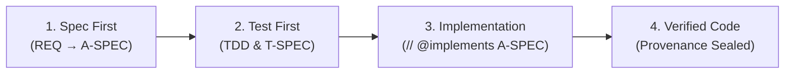

# 🔍 Holmes-Kit

[](https://www.npmjs.com/package/@holmes-lab/holmes-kit)
[](https://nodejs.org)
[](https://github.com/holmes-kit/holmes-kit/blob/main/LICENSE)

> **"No Spec, No Code"** — Deterministic Agentic Software Engineering (ASE) harness with causal traceability.

---

## 🕵️ Philosophy & Vision: Beyond Code Generation

**Holmes-Kit** is not merely an AI code generator. Inspired by **Sherlock Holmes**, Holmes-Kit is built to **deduce, track down, and analyze code defects, structural drift, and security vulnerabilities** across the full Software Development Life Cycle (**SDLC**).

---

### 🛡️ Currently Supported Features (Production Features)

- 🔁 **Import cycles are governed, at the three moments that can each do something** *(new in 0.19.0)*: the spec graph has been required to be acyclic since early on; the code graph now is too. **Guidance** reaches the agent before it designs (the authoring playbooks say "share types through a third module", pinned by test). **A design-time advisory** — `approval_status`'s `graphPreview` gains `cycles` — names the cycles your declared files are *already* in, with each edge classified as `type-erasable` (TypeScript deletes it, so it is not a runtime cycle), `lazy-require` (a workaround someone already paid for) or `eager-value`; the note says in words that this is **not** a prediction, because at approval time the code that would create a cycle does not exist yet. **A ratchet** in the Stop hook's constitution catches new cycles after the code is written — shipped in `track` (records, never blocks), and the escape is a **named exception**, never a threshold, so a project carrying legacy cycles can still adopt the harness. This repository went from three cycles to zero, and the two lazy `require()` workarounds they forced are gone.
- 📐 **Size and fan-in, shown but never judged** *(new in 0.19.0)*: the same design-time advisory carries `architecture` — lines, symbols, longest function, fan-in and fan-out for each declared file. Numbers only: no grade, no threshold, no participation in any verdict. A test pins the *absence* of a severity field, because one would grow into the gate the evidence does not support (the size/defect correlation in the literature is largely "there is more code"). Practitioners still reject inspecting more than five things, so the number is worth seeing — the person decides.
- 🎯 **Candidates you could actually act on** *(new in 0.19.0)*: the commit-history channel used to admit whatever git named, so ledger files and build baselines took emission slots — measured, **63.3% of candidate slots** went to files that cannot be the answer, one at the head of the list. Now history-derived candidates must be able to be source, vendored trees are demoted, and inside a file the search already found, def-use ranking puts the functions the request reaches through data flow first (symbol Top-10 recall 0.087 → 0.287 on this repository; unchanged on two others, and reported as conditional rather than general).
- 🧭 **The graph speaks BEFORE you commit to a scope** *(new in 0.18.0)*: the read-only `approval_status` now also answers `graphPreview` — `impact` (files that call INTO your declared Files-to-Touch from outside it, each anchor carrying its spec's intent sentence) and `density` (anchor-dense files inside the scope) — computed by the **same functions the sealing advisory uses**, so the preview can never disagree with the seal. Read the impact, then widen the declaration, narrow the design, or leave it knowingly; the authoring playbooks carry the step (pinned by test) and it stays a discipline, not a gate. Root-cause work gets the other half: `maintenance_analyze` candidates ride with `decisionContext` — the ADRs constraining that file and each decision's own sentence — which is the order a person diagnoses in (what broke, then why it was left this way). Both are information only: value tests pin that no ranking, score or gate reads them.
- 📜 **ADR as a first-class governed document** *(new in 0.18.0)*: decisions stop leaking into agent memory outside the gate (a measured incident on a consuming project drove this). `spec_create(type: "ADR")` scaffolds a root decision document (Context / Decision / Consequences / Alternatives, `decided`/`decider`) under the store's full authoring governance — validate, `spec_approve` seal, ledger, tamper-block — with its **own number space** (your existing `ADR-0001` just works) and a **hitl-only seal** (autonomy never self-approves a decision). Store ADRs join the existing decision surface with zero new edge kinds: `ADR-XXXX` citations in specs/code become `constrained_by` edges, `supersedes` chains link, the graph's SPEC:ADR node carries the Decision line as its intent summary, and legacy `.ax/decisions/` entries coexist (store wins on id collision). A migration guide ships at `docs/adr-migration.md`.

- 📣 **Impact Advisory at sealing time** *(new in 0.16.0)*: approving an A-SPEC now returns what your Files-to-Touch declaration *missed* — files whose symbols **call into** the declared scope from outside it (1-hop, capped, repo-relative allow-list), computed from the persisted RTM graph at the moment of sealing. Advisory, never verdict: it rides the response *after* the seal commits, degrades to absence on any failure, and every emission lands in an observation ledger so its false-positive rate is **measured before** anyone proposes a hard gate. The graph keeps itself fresh — `rtm_impact` rebuilds on basis drift and the Stop hook spawns a TTL-gated detached reindex (staleness was measured as the advisory's quality factor: 7 findings on an 8-day-old graph, 17 after a fresh one). *(0.17.0 hardening)*: the advisory/impact graph is **approved-only** (a draft needs no approval to exist, so it can no longer reach these agent-visible channels), summary prose can't forge graph rows (structural characters fold at both the extraction and storage boundaries), and annotations are capped with explicit omission counts (a hub-grade response shrank 104.7KB → 18.7KB, −82%). Sealing also gains an **anchor-density advisory** (observation-only): an A-SPEC whose Files-to-Touch contains an anchor-dense file (live anchors ≥ max(8, p90)) is annotated with `anchorDensity: [{path, anchors, p90}]` and ledgered — grounded in the measured precision tax of anchor accumulation; a count *gate* was considered and refused.
- 🗣️ **The graph speaks intent** *(new in 0.16.0)*: every SPEC node stores a one-sentence intent summary (`"<title> — <first sentence of its intent section>"`, schema `rtm-graph/3`, old stores rebuild automatically) — extracted deterministically, **never generated** (same store, byte-identical graph; measured cost +6.4% build time / +4.2% file size). Advisory anchors arrive as `{id, summary}` and `rtm_impact` adds `impactedSummaries`, so the reader sees *which intent* is at risk without a spec-store round trip. Information only: value tests pin that no verdict, ranking or gate reads the prose.
- 📇 **Session-context observability** *(new in 0.16.0)*: the ledger records which agent/model drove a session and what the governance overhead cost, per replica (`session-context.<replica>.jsonl`), grounding field reports in machine attribution instead of guesswork.

- 📋 **Requirements & Specification Governance**: Strict **"No Spec, No Code"** enforcement with 4-tier spec chain traceability (`REQ ➔ H-SPEC ➔ A-SPEC ➔ T-SPEC`) and `// @implements A-SPEC-XXX` code anchors (comma-lists and every anchor in a file participate in the gate).
- 🔴 **Inbuilt TDD — RED-first, enforced not asked** *(new in 0.9.0)*: the test-first discipline is a holmes-installed `holmes-tdd-slice` skill **and** a new constitution article **ART-8**. A changed A-SPEC must show a recorded `red-assertion → green` sequence in the ledger; a `red-error` (a test that could not run) is not a valid RED, so "the covering test failed *correctly*" is judged mechanically, not on trust. `test_run` classifies each covered file (`red-assertion`/`red-error`/`green`) and records per-A-SPEC outcomes the Stop hook reads. Ships at `redFirstEvidence: track` (observe-first, non-blocking; `strict`/`off` per repo), evidence-gated and jest-only for now. A T-SPEC may also declare `kills:` mutations and `test_run --mutate` reports which SURVIVED (a coverage gap). Where superpowers *asks* for RED-first and discriminating power, holmes-kit *proves* them.
- 🧰 **Governance UX tools** *(new in 0.10.0)*: `spec_unseal` (the inverse of `spec_approve` — return a sealed spec to editable `draft` in one act, out-of-band approval required, refuses approved dependents), `approval_status` and `ledger_timeline` (read-only observability into a spec's seal state and the governance history), and a structured `conflict` on `spec_approve`'s optimistic-concurrency refusal (read vs. current version + retry). See CHANGELOG for details.
- ⬆️ **Zero-config upgrades** *(new in 0.11.0)*: `holmes-kit upgrade` moves **every** wired workspace to the latest in one command — plan → confirm → install → re-pin all recorded workspaces (`--dry-run`/`--yes` supported). Preparation is automatic (each `init` records the workspace; a session whose pin is behind nudges you to upgrade); the re-pin **write** stays your explicit choice, never a silent auto-install. Opt out of the nudge with `HOLMES_NO_AUTO_REPIN`.
- 📊 **World-top-tier RTM dashboard** *(new in 0.12.0–0.12.1)*: `holmes-kit serve` — ask to *see* the RTM heatmap and the `rtm_dashboard` MCP tool launches the server idempotently and hands back the URL plus an honesty **census** (requirement/pipeline counts, coverage %, what's excluded). The heatmap is a real **2D coverage matrix** (requirements × pipeline stages, rows seriated by completeness, sequential-ramp cells with the percent printed in each). Drilling into a symbol renders that function's **CFG as a layered DAG** with **PDG (data/control-dependence) colour overlays**, served by `/api/cfg?file=&symbol=` from the same engine the taint lane uses — a non-CFG language is named, never faked. Tokenised palette (sequential ramp, status colours, UI/mono pairing) with light/dark.
- 🔢 **Sensible spec numbering** *(new in 0.12.1)*: a brand-new project's first slice is now **REQ-100**, not REQ-201 — `spec_slice_init` shares the same id allocator as the reverse-draft path (`nextIdBase`, floor 100). Existing projects are untouched: the next id is always `max(existing)+1`, so a repo already numbering from 201 keeps the exact same sequence. Numbering past 999 yields 4-digit ids cleanly, and ADR references now recognise 4-digit ADRs (`ADR-1000+`).
- 🤖 **Autonomous Approval — three layers, always bounded** *(reworked in 0.13.0; foundation 0.8.0)*: for teams that want the agent to self-drive the SDLC, autonomy is a posture the agent holds at two scopes — a **project default** you opt into at `holmes-kit init --autonomy` (persisted as the `HOLMES_AUTONOMOUS_APPROVAL` env in `.mcp.json`), and a **per-session envelope** you grant on the spot with `holmes-kit autonomy on --for 2h` (an expiring marker under the agent-write-protected `.ax/state/`). Under either, the agent seals **low-risk** specs itself (ledgered under an `autonomous:<client>` actor); every **governance-critical, high-risk, or irreversible** decision — `gate-behavior`/breaking A-SPECs, architecture/gate/taint files, and every upstream `REQ`/`H-SPEC`/`C-SPEC` — is instead **refused and routed to the out-of-band `holmes-kit approve` queue** for a human, never silently self-approved. The active posture is **surfaced at every session start** so it can't be forgotten *(0.14.0: the hook side now reads the project default out of `.mcp.json` directly, so an `init --autonomy` project sees its banner and escalations without an env round-trip)*, and an agent can never grant it to itself: the env is env-only (blocked like `HOLMES_ROLE`), the session command needs a real TTY or an out-of-band `HOLMES_APPROVAL`, and the marker lives where agents can't write. Off = byte-identical to a fully human-gated project. *(new in 0.10.0)* `HOLMES_ELICIT=off` routes every decision straight to the same queue.
- 🧭 **Spec-Evolution Trigger** *(new in 0.14.0)*: the gate used to judge only *where* a change lands (file ∈ Files-to-Touch, anchored, approved) — never *what kind* of change it is, so a real architecture swap inside an approved scope passed unreviewed. Now, when a changed in-scope source **newly introduces an external dependency** (a swapped engine, a new runtime), Holmes-Kit raises a **spec-reappraisal**: manual mode warns at the turn boundary, and under autonomy it also files the drift in the out-of-band `holmes-kit approve` queue so the owner sees it — a decided reappraisal is never re-raised for the same drift. Observe-first by design: it never blocks a turn. Detection is TS/JS + Python, string- and comment-safe (prettier multiline imports, CRLF files, docstrings and template literals all judged correctly).
- 🚢 **Release Autonomy + Docs-Currency Gate** *(new in 0.13.0)*: publishing is irreversible and outward, so `npm publish` stays **human-approved by default** — but a deterministic classifier (`releaseAutonomy`, reusing the same per-spec risk grade) lets a **low-risk** release (patch/minor, every spec auto-grade, autonomy on) self-publish under the ledger, while a **major** bump, any `gate-behavior`/security/architecture spec, or an upstream `REQ`/`H-SPEC` forces HITL. The `holmes-publish` playbook also gains a **docs-currency gate**: before any release it diffs the specs since the last tag and blocks if a user-facing change never reached `README`/`CHANGELOG` — a stale doc is a false claim.
- 🧭 **Compatibility declaration gate** *(new in 0.15.0)*: Holmes-Kit runs on three agent harnesses (Claude Code, Codex, Antigravity) and three OSes (Windows/macOS/Linux) — and now the **sealing act itself asks whether you considered them**. A new A-SPEC approves only with `harness_impact:` and `os_impact:` declared (`'none: <reason>'` or a full 3-cell mapping with `supported|unavailable|n-a` verdicts); a `none` claim is machine-cross-checked against Files-to-Touch (harness-surface paths, OS-signal file contents), the slice scaffold plants both fields as TODO the gate refuses untouched, and already-sealed specs are untouched — the duty arrives with the next re-approval, exactly like `breaking_change`.
- 🌐 **English CLI & hook surface** *(new in 0.13.0)*: the operator-facing CLI and hook messages — `doctor` output, the CLI usage/errors, the hook `deny` reasons and ART citations, and the interactive `approve`/`init`/`upgrade`/`semantic-key` prompts — are now English, guarded by a hangul-absence test over the **rendered runtime output** (not just a source scan, which misses `\u`-escaped strings). The MCP tool responses (`spec_create`/`spec_approve`/ledger/review) are still being migrated and are next.
- 🪧 **Session Banner + Update Notice** *(new in 0.8.0; refresh implemented + made uniform in 0.12.2)*: every session start emits an English intro (version + governance rule + npm URL) to both the human transcript and the agent context (SessionStart hook + MCP `instructions`); when a newer published version is on npm, an install-mode-aware `holmes-kit upgrade` command is appended. The registry refresh (dist-tags query → cached in `~/.holmes/update-check.json`) is detached, TTL-gated, and fail-silent, and now fires from **every harness's MCP-server startup** — not just Claude's SessionStart hook — so Claude / Antigravity / Codex are notified alike. Opts out via `HOLMES_NO_UPDATE_CHECK`/`CI`. Upgrade execution stays your explicit choice (`holmes-kit upgrade`), never a silent auto-install.
- 🧱 **Deterministic Gate, Hardened** *(new in 0.8.0; further hardened in 0.13.0)*: shell writes are judged at the segment's **effective working directory** (`cd sub && cat > ../src/x.ts` is sealed, legitimate out-of-tree scratch writes are freed); the governing anchor is the **whole set**, not the first match. *(0.13.0)* Two more bypasses are closed: the gate treats a project as **governed when any spec exists** (a fresh project holding only unapproved drafts is no longer an ungoverned free-for-all), and it classifies `cp`/`mv` by their **destination** (a copy/move landing on a source path is sealed even when the source file isn't code). Every gate change ships with two consecutive clean adversarial rounds.
- 🧠 **3-Tier Semantic Layer** *(new in 0.3.0)*: knowledge-graph semantic search with an explicit consent ladder — `none` (default, **zero egress**), `local` (bge-m3, no egress, optional module), `cloud` (gemini-embedding-001, opt-in via `GEMINI_API_KEY`). Measured on 305 traceability cases: recall 0.486 (lexical) → 0.667 (local) → **0.887 (cloud)**; on lexical-zero requests: 0% → 52% → **92%**. Surfaced only additively — rerank, evidence (`semCos`), and `semanticAlternates` — never as a hard filter.
- 🎯 **Graded Impact Surface** *(new in 0.3.0)*: `rankedImpact` (personalized-PageRank over the spec/code graph) beat its pre-registered naive baseline on **both recall and precision across 3 corpora (×1.6–×17)** — the necessary condition for any better-than-a-person phrasing, measured before claimed.
- 🐞 **Causal Defect Localization & CPG** *(equalized in 0.5–0.7)*: AST Code Property Graph (CFG/DDG/CDG) & Dataflow Taint reachability across 7 languages (TS/JS, Python, Go, Rust, Java, C/C++, C#) — **42 language×layer cells graded on measured evidence** (11 corpora, 39,344 functions, zero invariant violations; C++ conditional on 67.9% parse coverage, disclosed in the matrix).
- 📏 **Measured, Not Claimed** *(new in 0.3.x)*: performance is judged against a pre-registered modeled-human band (R 0.67–0.78 / P ≈0.9±). Current official grade: **band entry on recall; division-of-labor precision 0.727 = 81% of the modeled human — reproduced by an independent context-free judge on a fresh blind window.** No superhuman claims until both metrics exceed the band.
- 🧪 **Self-Healing & Diagnostic Doctor**: Automated integrity checks and self-healing auto-fix remediation (`holmes-kit doctor --fix` & `spec_remediate`) — wiring-handshake checks run on Windows natively as of 0.3.2. As of 0.9.0, doctor also reports holmes-kit's own advertised **MCP schema token cost** (computed live) and warns when `HOLMES_MCP_PROFILE=full` needlessly re-advertises the hook-enforced gate-duplicate tools.
- 🔔 **Approval UX** *(new in 0.3.1; inbox split 0.15.0)*: in-session approval dialogs forewarn their 120s deadline and, on expiry, the refusal says exactly where the decision went (`npx holmes-kit approve` out-of-band queue) — no more silently dead dialogs. Since 0.15.0 the tracked queue holds **decision-seeking requests only**; plain gate refusals live in a local per-machine refusal log (raw commands never leave the machine), browsable with `approve --refusals` and still decidable by id — measured before the split, 1,404 single-shot refusals were burying a 2-item inbox.
- 🚦 **Push & Server-Side Re-Validation** *(hardened in 0.8.0)*: a local `pre-push` evidence gate (test-run ledger head == push HEAD, green, executed > 0) plus a **server-side CI workflow** that re-runs `npm ci → build → full suite → tarball install probe`, so a `--no-verify` push or a hook-less clone is still caught.
- 📊 **Automated RTM & Taint Heatmap**: Interactive standalone HTML/SVG report generation (`generateRtmHeatmap`) for spec coverage and security dataflow reachability.
- 🤖 **CLI-First AI Harness Matrix**: Native process hook gating for Claude Code, Antigravity CLI (AGY), Codex CLI, and Google Antigravity SDK.

---

### 🚀 Full SDLC Vision & Roadmap (Future Goals)

Holmes-Kit strives to expand into a unified enterprise SDLC harness bridging external development tools:
- 🔌 **Enterprise Issue Tracker Connectors**: Flexible synchronization with Jira, GitHub Issues, Linear, and Notion.
- 🌐 **Multi-Repository Polyrepo Governance**: Multi-repo spec chain synchronization and cross-repository dependency impact analysis (`REQ-211`).
- 🛡️ **External SAST & Linter Bridge**: Deep integration with SonarQube, Semgrep, and ESLint findings.

---

## 🤖 Supported AI Coding Tools & Environments (CLI-First Focus)

Holmes-Kit prioritizes **CLI-based AI Coding Agents** where OS-level process hooks, subshell isolation, and deterministic control plane enforcement are natively guaranteed:

| AI Coding Agent / Framework | Harness Tier | Integration & Enforcement Mechanisms |
| :--- | :--- | :--- |
| 🤖 **Claude Code CLI** | 🥇 Tier 1 (Native) | OS PreToolUse & Stop hooks (`.claude/settings.local.json`), MCP server (`.mcp.json`) |
| 🚀 **Antigravity CLI (AGY)** | 🥇 Tier 1 (Native) | AGY Hooks (`hooks.json`), MCP config (`.agents/mcp_config.json`), Governance Skills |
| 💻 **Codex CLI / Agentic Shell** | 🥇 Tier 1 (Native) | Codex MCP integration (`.codex/config.toml`), plugin-packaged gate hooks at the marketplace path Codex reads (`.claude-plugin/marketplace.json`, codex-cli 0.152.x). Hard-gate enforcement verified on real codex-cli: the captured PreToolUse payload is judged and an unauthorized code-write is denied. |
| 🧩 **Google Antigravity SDK** | 🥇 Tier 1 (Native) | Autonomous Agent SDK bindings and cryptographic provenance verification |

> **Note**: Holmes-Kit focuses strictly on CLI-based autonomous agents to guarantee 100% deterministic OS hook gating (`deny` enforcement) before file modifications occur.

---

## ⚡ Quickstart (3-Minute Setup)

### 1. Install — find your row first

The same wrong command was run three times by a real adopter before the right one; a table beats
prose read top-to-bottom.

**Windows (recommended)** — a bootstrap installer that runs *before* npm and fixes what npm cannot: it relocates out of protected folders (an elevated PowerShell opens in `C:\WINDOWS\System32`, where `npm install` fails with `EPERM`), checks the Node.js version, and, if a native module fails to build, prints the one `winget` command that installs the missing C++ toolchain instead of raw compiler output. Pure Windows PowerShell 5.1; no prompts; nothing persistent is changed.
```powershell
# From a downloaded copy of the package (e.g. after `npm pack`, or from a checkout):
powershell -NoProfile -ExecutionPolicy Bypass -File scripts\install.ps1

# One-liner (once hosted):
# irm https://<host>/install.ps1 | iex
```
Add `-DryRun` to see what it would do without installing. Exit codes: `0` ok / already installed · `2` bad argument · `3` Node.js too old · `4` npm failed (remediation printed) · `5` installed but not on `PATH` (prefix printed).

| Which situation are you in? | Privileges | Command |
|---|---|---|
| **Using it in one project** (most people) | none | `npm install --save-dev @holmes-lab/holmes-kit` |
| **Zero-install one-shot** (try it first) | none | `npx -y @holmes-lab/holmes-kit init` — npx fetches and runs, nothing to install beforehand |
| Company-managed PC / restricted account | none | same — no system directory is touched |
| CI / container | none | same, plus `--prefer-online` right after a release |
| CLI across many projects (`-g`) | depends | run `npm config get prefix` first — see below |

**Stale global shadowing** *(field-measured on Windows, 2026-08-31)*: an old global install makes the
bare `holmes-kit` command run the OLD version while `npx holmes-kit` runs the local one — and
Windows has TWO global roots (`C:\Program Files\nodejs` and `%APPDATA%\npm`), so `npm uninstall -g`
against one root can leave a live shim in the other. If `holmes-kit --version` and
`npx holmes-kit --version` disagree, run `where.exe holmes-kit` (Windows) / `which -a holmes-kit`
and remove the stale shim; prefer the `npx` form day-to-day.

**Before `npm install -g`**: if `npm config get prefix` names a protected directory
(`C:\Program Files\nodejs`, `/usr/local`), `-g` dies with `EPERM` **before any package file
arrives** — no package version can fix that, and elevation is the wrong fix (it runs native
install scripts with system privileges, and it did not even work in the reported case). Move the
prefix to user space instead — one-time setup, exact commands in the
**[Install Guide](docs/install-guide.md)**, along with troubleshooting keyed to the exact error
text (`EPERM mkdir`, `notarget`, `better-sqlite3` build failures).

**Prerequisites** — Node.js `>= 20.0.0`. The 8 tree-sitter grammars ship prebuilt binaries for
macOS/Linux/Windows and compile nothing; `better-sqlite3` downloads a prebuild at install time,
falling back to compiling — only that fallback needs a C++ toolchain (VS Build Tools / Xcode CLT /
`apk add python3 make g++`).

### 2. Initialize in Your Project
```bash
cd /path/to/your/project
npx holmes-kit init      # drop the npx prefix if you installed with -g
```
*An interactive prompt will ask which AI agent harnesses to wire into your project:*
```text
? Select the AI Agent harnesses to wire into this project:
  [X] 🤖 Claude Code          (.claude/settings.local.json, .mcp.json)
  [X] 🚀 Antigravity CLI (AGY) (.agents/mcp_config.json, hooks.json, skills)
  [ ] 💻 Codex CLI            (.codex/config.toml)
```
*It then asks — defaulting to **No** — whether to grant **autonomous spec approval** (low-risk specs
self-seal; governance-critical, high-risk and irreversible always stay human). Skip the prompt with
`--autonomy` / `--no-autonomy`, or turn it on later per-session with `holmes-kit autonomy on`.*

### 3. Verify Health
```bash
npx holmes-kit doctor
```
*If everything is green, your project is governed and ready for AI pair-programming!*

### 4. Optional: Enable the Semantic Layer (Tier `local` / Tier `cloud`)

Out of the box Holmes-Kit runs tier **`none`** — lexical + citation + graph search, **zero
egress**. Two opt-in tiers raise recall on requests your vocabulary can't reach (measured on 305
traceability cases — see the feature list above):

**Tier `local` — no egress, no account.** Install the optional embedding runtime next to
holmes-kit and the local model (`bge-m3`) is picked up automatically:
```bash
npm install --save-dev @xenova/transformers
npx holmes-kit doctor        # → semantic tier: local (no egress)
```

**Tier `cloud` — highest recall, explicit consent (`gemini-embedding-001`).** Setting a key IS
the consent act: with a key present, repository-derived text is sent to Google's embedding API.

1. Get a Gemini API key (Google AI Studio → <https://aistudio.google.com/apikey>; the free tier
   is enough to try it).
2. Store it **outside your project tree** with the built-in command — the key rides **stdin,
   never argv**, lands in `~/.holmes/credentials.json` with `0600` permissions, and no output
   ever contains the value:
   ```bash
   npx holmes-kit semantic-key set        # hidden prompt on a TTY; or:  echo "$KEY" | npx holmes-kit semantic-key set
   npx holmes-kit semantic-key status     # shows the key's SOURCE only, never the value
   npx holmes-kit doctor                  # → semantic tier: cloud (egress: on)
   ```
   On macOS the key prefers the system keychain; elsewhere the `0600` file is the store.
   Environment variables also work and take precedence (`HOLMES_SEMANTIC_API_KEY` dedicated, or
   the ecosystem-compatible `GEMINI_API_KEY` / `GOOGLE_API_KEY`) — useful for CI. Prefer
   `semantic-key set` on workstations: it keeps the key out of shell history, `.env` files, and
   the repository.
3. To revoke consent at any time:
   ```bash
   npx holmes-kit semantic-key unset      # clears the stored key; tier falls back to local/none
   ```

> 🔒 **Never** commit a key, pass it as a CLI argument, or put it in a file inside the project
> tree. Holmes-Kit's credential chain has **no project-tree source by design**, and agents are
> gated from setting keys on their own — consent stays a human act.

---

## 🔄 Daily Workflow (How It Works)

Once initialized, your AI agent automatically follows the **No Spec, No Code** lifecycle:



1. **Spec First**: The agent authors requirements and architecture specs via `spec_create`.
2. **Test First**: The agent writes tests and approves `T-SPEC` before writing implementation code.
3. **Implement**: Code files anchor to their architecture spec with `// @implements A-SPEC-NNN`.
4. **Deterministic Guard**: If the agent attempts to write code without approved specs, **Holmes-Kit hooks block the action and provide exact next steps**.

---

## 🧰 Essential CLI Cheatsheet

| Command | Purpose |
| :--- | :--- |
| `holmes-kit init` | Interactive agent harness setup (Claude, Antigravity, Codex) |
| `holmes-kit init --agent all` | Non-interactive instant setup for all supported agents |
| `holmes-kit init --autonomy` | Opt the project into autonomous spec approval (low-risk only; governance-critical still HITL) |
| `holmes-kit init --dry-run` | Preview files and configuration changes without writing |
| `holmes-kit autonomy status` | Show the current autonomous-approval posture (project default + session envelope) |
| `holmes-kit autonomy on --for 2h` | Self-drive low-risk specs for this session only (expiring; needs a TTY or `HOLMES_APPROVAL`) |
| `holmes-kit autonomy off` | End session autonomy immediately |
| `holmes-kit doctor` | Comprehensive health check of specs, hooks, MCP, and anchors |
| `holmes-kit doctor --fix` | Automatically self-heal and repair broken hooks or missing skills |
| `holmes-kit ci` | Run non-interactive headless governance gate for GitHub Actions / GitLab CI |
| `holmes-kit ci --json` | Run CI gate and emit machine-readable JSON results |

---

## 🧩 Optional: Manual MCP Integration (Cursor, Windsurf, Claude Desktop)

> **Note**: If you ran `holmes-kit init`, this configuration is **100% automated for you**.  
> Use the manual configuration below only if you wish to integrate Holmes-Kit into standalone third-party MCP clients like Cursor, Windsurf, Claude Desktop, or VS Code:

```json
{
  "mcpServers": {
    "holmes-kit": {
      "command": "npx",
      "args": ["-y", "--package=@holmes-lab/holmes-kit", "holmes-mcp"],
      "env": {
        "HOLMES_SPECS": ".ax/specs"
      }
    }
  }
}
```

---

## 🌐 Supported Languages & Environments

Holmes-Kit embeds native AST & Code Property Graph (D-CPG) analyzers to track causal relationships and anchor implementations across diverse technology stacks.

### 💻 Supported Programming Languages

<!-- language-matrix:begin -->
| Language | relations | ast | cfg | ddg | cdg | taint | Corpus evidence |
| :--- | :---: | :---: | :---: | :---: | :---: | :---: | :--- |
| **TypeScript / JavaScript** | ● | ● | ● | ● | ● | ● | 10,929 functions (this repository), zero invariant violations |
| **Python** | ● | ● | ● | ● | ● | ● | 1,209 functions (jarvis), zero invariant violations |
| **C#** | ● | ● | ● | ● | ● | ● | 9,184 functions (Newtonsoft.Json + RestSharp), zero invariant violations — 4.4% of files refuse at L1 (preprocessor across syntax) |
| **Java** | ● | ● | ● | ● | ● | ● | 8,376 functions (gson + junit4), zero invariant violations |
| **Go** | ● | ● | ● | ● | ● | ● | 2,637 functions (gin + cobra), zero invariant violations |
| **Rust** | ● | ● | ● | ● | ● | ● | 5,247 functions (ripgrep + serde), zero invariant violations |
| **C++** | ● | ● | ● | ● | ● | ● | 1,762 functions (nlohmann + fmt + leveldb), zero invariant violations — 32.1% of template/macro-heavy files refuse at L1 — layers above speak only for what parses |

Every grade is a measurement, not a goal: a cell moves only when a real corpus proves it.
Full per-cell bases (and every stated limit) live in [docs/language-support.md](docs/language-support.md), which is generated from the same derivation and byte-pinned by the suite — as is this table.
<!-- language-matrix:end -->

### 🖥️ Supported Operating Systems & Runtimes
| OS / Platform | Architecture | Status | Notes |
| :--- | :--- | :---: | :--- |
| **macOS** | Apple Silicon (arm64) / Intel (x64) | ✅ Tier 1 | macOS 12+ (Full hook enforcement) |
| **Linux** | x86_64 / arm64 | ✅ Tier 1 | Ubuntu, Debian, Fedora, Arch, RHEL |
| **Windows (WSL2)** | x86_64 | ✅ Tier 1 | WSL2 Ubuntu/Debian recommended |
| **Windows Native** | x86_64 | ✅ Tier 1 | Windows 10/11 (Node.js 20+; prebuilt natives, no build tools needed in the common case). **Field-validated 2026-08-31** on a real user machine: registry install, natives (better-sqlite3 + 7 tree-sitter grammars), both OS gates, MCP handshake (30 tools), interactive init TUI, out-of-band approval channel (doctor 25 PASS; the 4 false FAILs it also showed were doctor's own win32 spawn bug, fixed in 0.3.2). See ADR-015 (platform tier is decided by executed verification — internal decision record) for tier criteria and residual risks (NTFS 8.3 names, reserved device names, 260-char paths; no Windows CI yet) |

> **Runtime Requirement**: Node.js `>= 20.0.0` (LTS recommended)
>
> **How a tier is decided**: by the verification that actually executes, not by declaration. A platform is Tier 1 only while its gate verdicts are exercised by the suite; if that stops being true it is demoted and the demotion is recorded. See ADR-015 (platform tier is decided by executed verification — internal decision record).

---

## 🔒 Source Code Availability & Distribution Policy

- **Distribution Mode**: Holmes-Kit is currently distributed and executable as an official public npm package ([`@holmes-lab/holmes-kit`](https://www.npmjs.com/package/@holmes-lab/holmes-kit)).
- **Source Code Status**: The underlying source code repository is currently **private / closed-source**.
- **Open Source Consideration**: Decisions regarding whether, when, and how to transition to a full open-source codebase will be reviewed and determined in future milestones based on enterprise feedback, security audits, and community governance requirements.

---

## 📜 License

Distributed under the [MIT License](https://github.com/holmes-kit/holmes-kit/blob/main/LICENSE).
