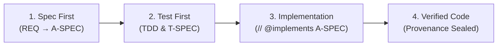

# 🔍 Holmes-Kit

[](https://www.npmjs.com/package/@holmes-lab/holmes-kit)
[](https://nodejs.org)
[](https://github.com/holmes-kit/holmes-kit/blob/main/LICENSE)

> **"No Spec, No Code"** — Deterministic Agentic Software Engineering (ASE) harness with causal traceability.

---

## 🕵️ Philosophy & Vision: Beyond Code Generation

**Holmes-Kit** is not merely an AI code generator. Inspired by **Sherlock Holmes**, Holmes-Kit is built to **deduce, track down, and analyze code defects, structural drift, and security vulnerabilities** across the full Software Development Life Cycle (**SDLC**).

---

### 🛡️ Currently Supported Features (v0.3.x Production Features)

- 📋 **Requirements & Specification Governance**: Strict **"No Spec, No Code"** enforcement with 4-tier spec chain traceability (`REQ ➔ H-SPEC ➔ A-SPEC ➔ T-SPEC`) and `// @implements A-SPEC-XXX` line 1 code anchors.
- 🧠 **3-Tier Semantic Layer** *(new in 0.3.0)*: knowledge-graph semantic search with an explicit consent ladder — `none` (default, **zero egress**), `local` (bge-m3, no egress, optional module), `cloud` (gemini-embedding-001, opt-in via `GEMINI_API_KEY`). Measured on 305 traceability cases: recall 0.486 (lexical) → 0.667 (local) → **0.887 (cloud)**; on lexical-zero requests: 0% → 52% → **92%**. Surfaced only additively — rerank, evidence (`semCos`), and `semanticAlternates` — never as a hard filter.
- 🎯 **Graded Impact Surface** *(new in 0.3.0)*: `rankedImpact` (personalized-PageRank over the spec/code graph) beat its pre-registered naive baseline on **both recall and precision across 3 corpora (×1.6–×17)** — the necessary condition for any better-than-a-person phrasing, measured before claimed.
- 🐞 **Causal Defect Localization & CPG**: AST Code Property Graph (CPG) & Dataflow Taint reachability analysis across 7 languages (TS/JS, Python, Go, Rust, Java, C/C++, C#).
- 📏 **Measured, Not Claimed** *(new in 0.3.x)*: performance is judged against a pre-registered modeled-human band (R 0.67–0.78 / P ≈0.9±). Current official grade: **band entry on recall; division-of-labor precision 0.727 = 81% of the modeled human — reproduced by an independent context-free judge on a fresh blind window.** No superhuman claims until both metrics exceed the band.
- 🧪 **Self-Healing & Diagnostic Doctor**: Automated integrity checks and self-healing auto-fix remediation (`holmes-kit doctor --fix` & `spec_remediate`) — wiring-handshake checks run on Windows natively as of 0.3.2.
- 🔔 **Approval UX** *(new in 0.3.1)*: in-session approval dialogs forewarn their 120s deadline and, on expiry, the refusal says exactly where the decision went (`npx holmes-kit approve` out-of-band queue) — no more silently dead dialogs.
- 🚦 **CI/CD Governance Gate Runner**: Non-interactive headless CI/CD build gate (`holmes-kit ci`) for GitHub Actions and GitLab CI pipelines.
- 📊 **Automated RTM & Taint Heatmap**: Interactive standalone HTML/SVG report generation (`generateRtmHeatmap`) for spec coverage and security dataflow reachability.
- 🤖 **CLI-First AI Harness Matrix**: Native process hook gating for Claude Code, Antigravity CLI (AGY), Codex CLI, and Google Antigravity SDK.

---

### 🚀 Full SDLC Vision & Roadmap (Future Goals)

Holmes-Kit strives to expand into a unified enterprise SDLC harness bridging external development tools:
- 🔌 **Enterprise Issue Tracker Connectors**: Flexible synchronization with Jira, GitHub Issues, Linear, and Notion.
- 🌐 **Multi-Repository Polyrepo Governance**: Multi-repo spec chain synchronization and cross-repository dependency impact analysis (`REQ-211`).
- 🛡️ **External SAST & Linter Bridge**: Deep integration with SonarQube, Semgrep, and ESLint findings.

---

## 🤖 Supported AI Coding Tools & Environments (CLI-First Focus)

Holmes-Kit prioritizes **CLI-based AI Coding Agents** where OS-level process hooks, subshell isolation, and deterministic control plane enforcement are natively guaranteed:

| AI Coding Agent / Framework | Harness Tier | Integration & Enforcement Mechanisms |
| :--- | :--- | :--- |
| 🤖 **Claude Code CLI** | 🥇 Tier 1 (Native) | OS PreToolUse & Stop hooks (`.claude/settings.local.json`), MCP server (`.mcp.json`) |
| 🚀 **Antigravity CLI (AGY)** | 🥇 Tier 1 (Native) | AGY Hooks (`hooks.json`), MCP config (`.agents/mcp_config.json`), Governance Skills |
| 💻 **Codex CLI / Agentic Shell** | 🥇 Tier 1 (Native) | Codex MCP integration (`.codex/config.toml`), plugin-packaged gate hooks (installed via Codex plugin marketplace) |
| 🧩 **Google Antigravity SDK** | 🥇 Tier 1 (Native) | Autonomous Agent SDK bindings and cryptographic provenance verification |

> **Note**: Holmes-Kit focuses strictly on CLI-based autonomous agents to guarantee 100% deterministic OS hook gating (`deny` enforcement) before file modifications occur.

---

## ⚡ Quickstart (3-Minute Setup)

### 1. Install — find your row first

The same wrong command was run three times by a real adopter before the right one; a table beats
prose read top-to-bottom.

**Windows (recommended)** — a bootstrap installer that runs *before* npm and fixes what npm cannot: it relocates out of protected folders (an elevated PowerShell opens in `C:\WINDOWS\System32`, where `npm install` fails with `EPERM`), checks the Node.js version, and, if a native module fails to build, prints the one `winget` command that installs the missing C++ toolchain instead of raw compiler output. Pure Windows PowerShell 5.1; no prompts; nothing persistent is changed.
```powershell
# From a downloaded copy of the package (e.g. after `npm pack`, or from a checkout):
powershell -NoProfile -ExecutionPolicy Bypass -File scripts\install.ps1

# One-liner (once hosted):
# irm https://<host>/install.ps1 | iex
```
Add `-DryRun` to see what it would do without installing. Exit codes: `0` ok / already installed · `2` bad argument · `3` Node.js too old · `4` npm failed (remediation printed) · `5` installed but not on `PATH` (prefix printed).

| Which situation are you in? | Privileges | Command |
|---|---|---|
| **Using it in one project** (most people) | none | `npm install --save-dev @holmes-lab/holmes-kit` |
| **Zero-install one-shot** (try it first) | none | `npx -y @holmes-lab/holmes-kit init` — npx fetches and runs, nothing to install beforehand |
| Company-managed PC / restricted account | none | same — no system directory is touched |
| CI / container | none | same, plus `--prefer-online` right after a release |
| CLI across many projects (`-g`) | depends | run `npm config get prefix` first — see below |

**Stale global shadowing** *(field-measured on Windows, 2026-08-31)*: an old global install makes the
bare `holmes-kit` command run the OLD version while `npx holmes-kit` runs the local one — and
Windows has TWO global roots (`C:\Program Files\nodejs` and `%APPDATA%\npm`), so `npm uninstall -g`
against one root can leave a live shim in the other. If `holmes-kit --version` and
`npx holmes-kit --version` disagree, run `where.exe holmes-kit` (Windows) / `which -a holmes-kit`
and remove the stale shim; prefer the `npx` form day-to-day.

**Before `npm install -g`**: if `npm config get prefix` names a protected directory
(`C:\Program Files\nodejs`, `/usr/local`), `-g` dies with `EPERM` **before any package file
arrives** — no package version can fix that, and elevation is the wrong fix (it runs native
install scripts with system privileges, and it did not even work in the reported case). Move the
prefix to user space instead — one-time setup, exact commands in the
**[Install Guide](docs/install-guide.md)**, along with troubleshooting keyed to the exact error
text (`EPERM mkdir`, `notarget`, `better-sqlite3` build failures).

**Prerequisites** — Node.js `>= 20.0.0`. The 8 tree-sitter grammars ship prebuilt binaries for
macOS/Linux/Windows and compile nothing; `better-sqlite3` downloads a prebuild at install time,
falling back to compiling — only that fallback needs a C++ toolchain (VS Build Tools / Xcode CLT /
`apk add python3 make g++`).

### 2. Initialize in Your Project
```bash
cd /path/to/your/project
npx holmes-kit init      # drop the npx prefix if you installed with -g
```
*An interactive prompt will ask which AI agent harnesses to wire into your project:*
```text
? Select the AI Agent harnesses to wire into this project:
  [X] 🤖 Claude Code          (.claude/settings.local.json, .mcp.json)
  [X] 🚀 Antigravity CLI (AGY) (.agents/mcp_config.json, hooks.json, skills)
  [ ] 💻 Codex CLI            (.codex/config.toml)
```

### 3. Verify Health
```bash
npx holmes-kit doctor
```
*If everything is green, your project is governed and ready for AI pair-programming!*

### 4. Optional: Enable the Semantic Layer (Tier `local` / Tier `cloud`)

Out of the box Holmes-Kit runs tier **`none`** — lexical + citation + graph search, **zero
egress**. Two opt-in tiers raise recall on requests your vocabulary can't reach (measured on 305
traceability cases — see the feature list above):

**Tier `local` — no egress, no account.** Install the optional embedding runtime next to
holmes-kit and the local model (`bge-m3`) is picked up automatically:
```bash
npm install --save-dev @xenova/transformers
npx holmes-kit doctor        # → semantic tier: local (no egress)
```

**Tier `cloud` — highest recall, explicit consent (`gemini-embedding-001`).** Setting a key IS
the consent act: with a key present, repository-derived text is sent to Google's embedding API.

1. Get a Gemini API key (Google AI Studio → <https://aistudio.google.com/apikey>; the free tier
   is enough to try it).
2. Store it **outside your project tree** with the built-in command — the key rides **stdin,
   never argv**, lands in `~/.holmes/credentials.json` with `0600` permissions, and no output
   ever contains the value:
   ```bash
   npx holmes-kit semantic-key set        # hidden prompt on a TTY; or:  echo "$KEY" | npx holmes-kit semantic-key set
   npx holmes-kit semantic-key status     # shows the key's SOURCE only, never the value
   npx holmes-kit doctor                  # → semantic tier: cloud (egress: on)
   ```
   On macOS the key prefers the system keychain; elsewhere the `0600` file is the store.
   Environment variables also work and take precedence (`HOLMES_SEMANTIC_API_KEY` dedicated, or
   the ecosystem-compatible `GEMINI_API_KEY` / `GOOGLE_API_KEY`) — useful for CI. Prefer
   `semantic-key set` on workstations: it keeps the key out of shell history, `.env` files, and
   the repository.
3. To revoke consent at any time:
   ```bash
   npx holmes-kit semantic-key unset      # clears the stored key; tier falls back to local/none
   ```

> 🔒 **Never** commit a key, pass it as a CLI argument, or put it in a file inside the project
> tree. Holmes-Kit's credential chain has **no project-tree source by design**, and agents are
> gated from setting keys on their own — consent stays a human act.

---

## 🔄 Daily Workflow (How It Works)

Once initialized, your AI agent automatically follows the **No Spec, No Code** lifecycle:



1. **Spec First**: The agent authors requirements and architecture specs via `spec_create`.
2. **Test First**: The agent writes tests and approves `T-SPEC` before writing implementation code.
3. **Implement**: Code files anchor to their architecture spec with `// @implements A-SPEC-NNN`.
4. **Deterministic Guard**: If the agent attempts to write code without approved specs, **Holmes-Kit hooks block the action and provide exact next steps**.

---

## 🧰 Essential CLI Cheatsheet

| Command | Purpose |
| :--- | :--- |
| `holmes-kit init` | Interactive agent harness setup (Claude, Antigravity, Codex) |
| `holmes-kit init --agent all` | Non-interactive instant setup for all supported agents |
| `holmes-kit init --dry-run` | Preview files and configuration changes without writing |
| `holmes-kit doctor` | Comprehensive health check of specs, hooks, MCP, and anchors |
| `holmes-kit doctor --fix` | Automatically self-heal and repair broken hooks or missing skills |
| `holmes-kit ci` | Run non-interactive headless governance gate for GitHub Actions / GitLab CI |
| `holmes-kit ci --json` | Run CI gate and emit machine-readable JSON results |

---

## 🧩 Optional: Manual MCP Integration (Cursor, Windsurf, Claude Desktop)

> **Note**: If you ran `holmes-kit init`, this configuration is **100% automated for you**.  
> Use the manual configuration below only if you wish to integrate Holmes-Kit into standalone third-party MCP clients like Cursor, Windsurf, Claude Desktop, or VS Code:

```json
{
  "mcpServers": {
    "holmes-kit": {
      "command": "npx",
      "args": ["-y", "--package=@holmes-lab/holmes-kit", "holmes-mcp"],
      "env": {
        "HOLMES_SPECS": ".ax/specs"
      }
    }
  }
}
```

---

## 🌐 Supported Languages & Environments

Holmes-Kit embeds native AST & Code Property Graph (D-CPG) analyzers to track causal relationships and anchor implementations across diverse technology stacks.

### 💻 Supported Programming Languages
| Language | CPG Parser | Anchor Syntax | Dataflow Taint & RTM |
| :--- | :--- | :--- | :---: |
| **TypeScript / JavaScript** | Tree-sitter TypeScript/JS | `// @implements A-SPEC-XXX` | ✅ Full Support |
| **Python** | Tree-sitter Python | `# @implements A-SPEC-XXX` | ✅ Full Support |
| **Go** | Tree-sitter Go | `// @implements A-SPEC-XXX` | ✅ Full Support |
| **Rust** | Tree-sitter Rust | `// @implements A-SPEC-XXX` | ✅ Full Support |
| **Java** | Tree-sitter Java | `// @implements A-SPEC-XXX` | ✅ Full Support |
| **C / C++** | Tree-sitter C/C++ | `// @implements A-SPEC-XXX` | ✅ Full Support |
| **C# (.NET)** | Tree-sitter C# | `// @implements A-SPEC-XXX` | ✅ Full Support |

### 🖥️ Supported Operating Systems & Runtimes
| OS / Platform | Architecture | Status | Notes |
| :--- | :--- | :---: | :--- |
| **macOS** | Apple Silicon (arm64) / Intel (x64) | ✅ Tier 1 | macOS 12+ (Full hook enforcement) |
| **Linux** | x86_64 / arm64 | ✅ Tier 1 | Ubuntu, Debian, Fedora, Arch, RHEL |
| **Windows (WSL2)** | x86_64 | ✅ Tier 1 | WSL2 Ubuntu/Debian recommended |
| **Windows Native** | x86_64 | ✅ Tier 1 | Windows 10/11 (Node.js 20+; prebuilt natives, no build tools needed in the common case). **Field-validated 2026-08-31** on a real user machine: registry install, natives (better-sqlite3 + 7 tree-sitter grammars), both OS gates, MCP handshake (30 tools), interactive init TUI, out-of-band approval channel (doctor 25 PASS; the 4 false FAILs it also showed were doctor's own win32 spawn bug, fixed in 0.3.2). See ADR-015 (platform tier is decided by executed verification — internal decision record) for tier criteria and residual risks (NTFS 8.3 names, reserved device names, 260-char paths; no Windows CI yet) |

> **Runtime Requirement**: Node.js `>= 20.0.0` (LTS recommended)
>
> **How a tier is decided**: by the verification that actually executes, not by declaration. A platform is Tier 1 only while its gate verdicts are exercised by the suite; if that stops being true it is demoted and the demotion is recorded. See ADR-015 (platform tier is decided by executed verification — internal decision record).

---

## 🔒 Source Code Availability & Distribution Policy

- **Distribution Mode**: Holmes-Kit is currently distributed and executable as an official public npm package ([`@holmes-lab/holmes-kit`](https://www.npmjs.com/package/@holmes-lab/holmes-kit)).
- **Source Code Status**: The underlying source code repository is currently **private / closed-source**.
- **Open Source Consideration**: Decisions regarding whether, when, and how to transition to a full open-source codebase will be reviewed and determined in future milestones based on enterprise feedback, security audits, and community governance requirements.

---

## 📜 License

Distributed under the [MIT License](https://github.com/holmes-kit/holmes-kit/blob/main/LICENSE).
